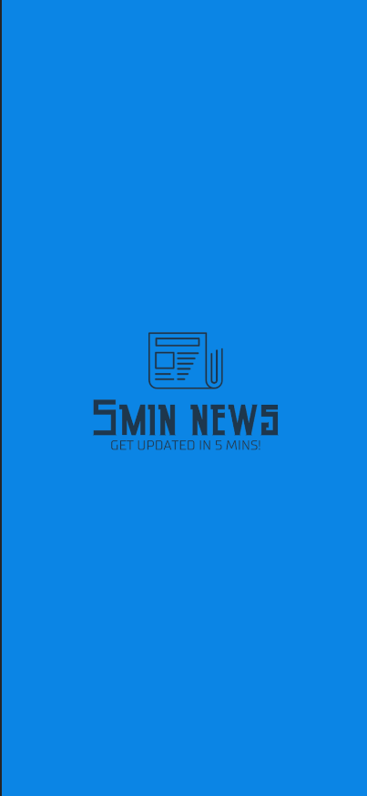
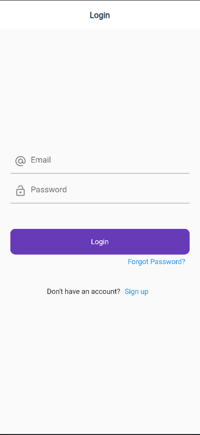
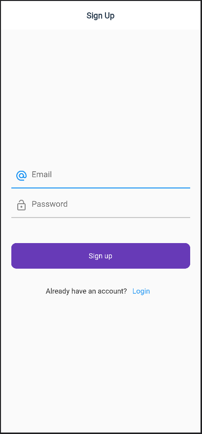
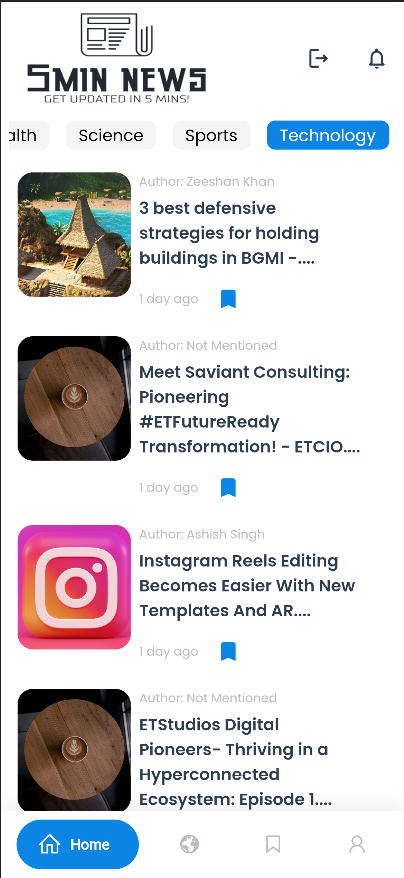
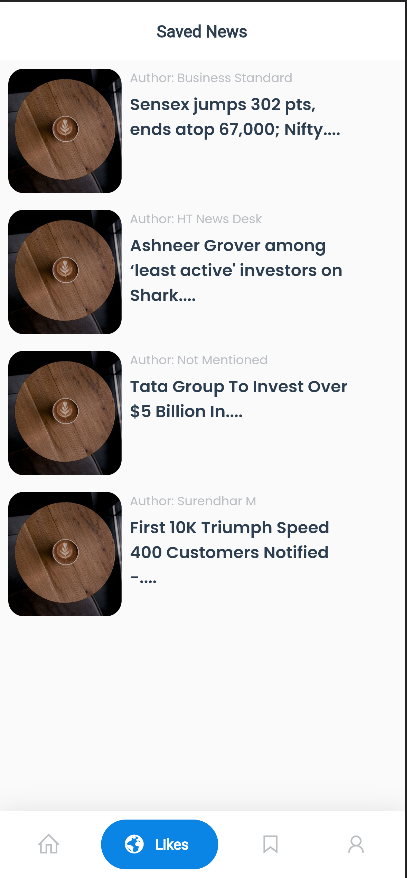

 <h1 align="center"> 5Min News</h1>

 <h2 align = "center"> ◀️ Introduction ▶️ </h2>

 5 min news platform to read news fast and save some time

  

#### Tech-Stack used :

<!--   
<code> -->
  
  

### Screenshots
     

video explanation - https://youtu.be/NGWuXgWS8ws

